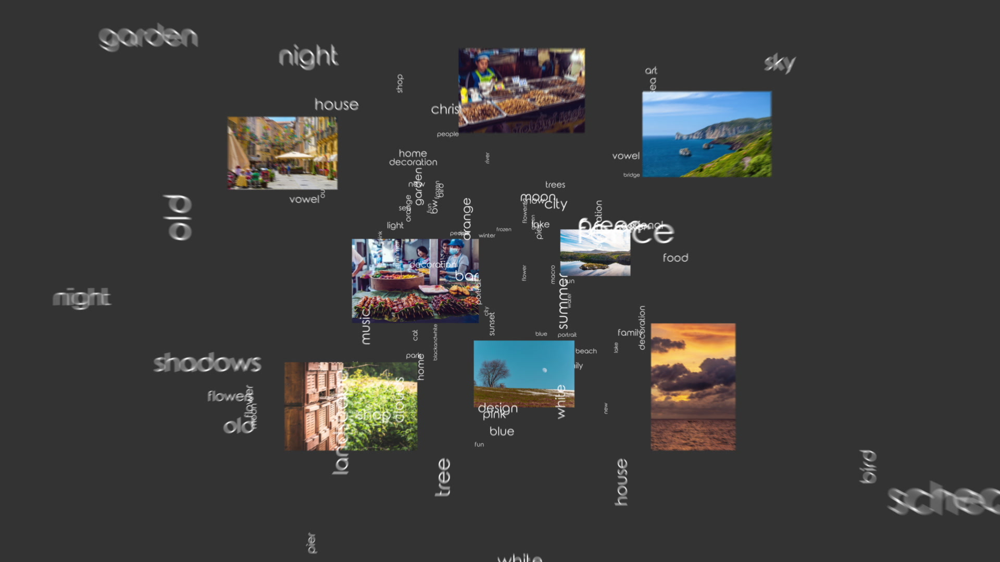

<h1 align="center">
photils
</h1>

Let the machine suggest hashtags for your images.

## Information
Photils includes an algorithm for generating hash tags for selected images using neural networks. <b>Privacy</b> is a key issue with photils, so the selected images never leave the phone. Check the video below for further details!

## Troubleshooting
Found a bug? Use the projects [issue page](https://github.com/scheckmedia/photilsNative/issues) to let us know about it.

## Contributing

Want to contribute to Photils? We're happy to get some help during development. Send us a Pull Request or get in touch.

### Fork it

Fork the project and implement your own modules. We're happy to receive your Pull Request!

## License

[Apache License 2.0](https://github.com/scheckmedia/photilsNative/blob/master/LICENSE.md)
